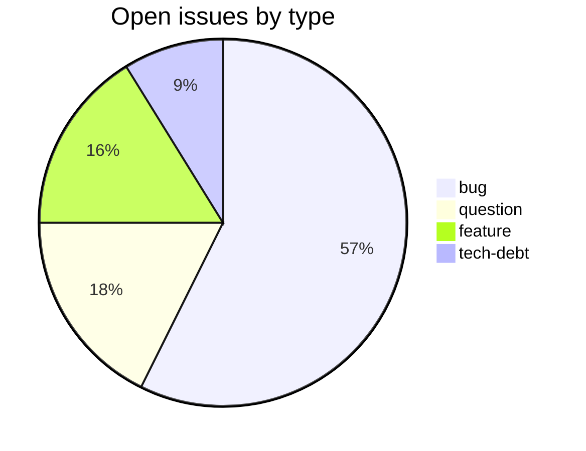
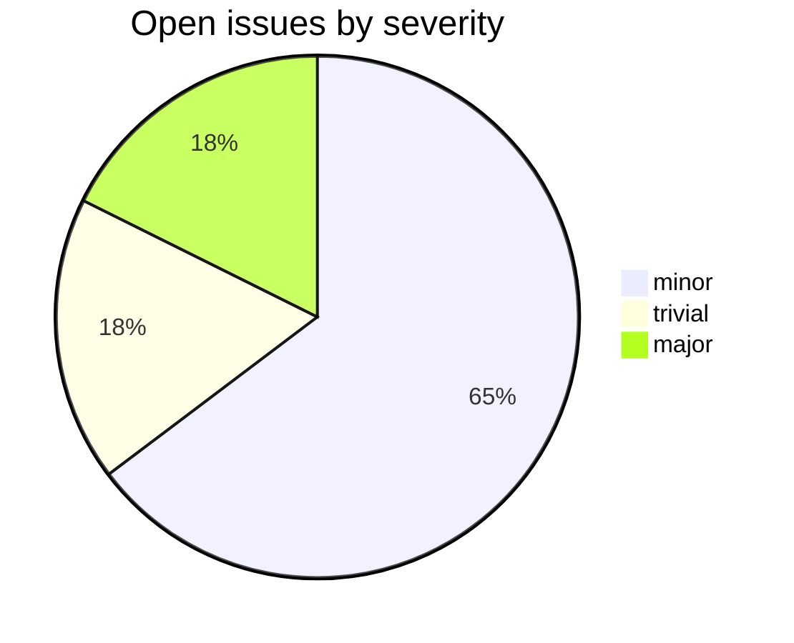

# csl-orig

CDSL **data-store** repository in the Sanskrit Lexicon project.
Data for all dictionaries of Cologne. Now all corrections are made in this git-based workflow.

<!-- BEGIN MANUAL: overview -->
`csl-orig` is the canonical source-text repository for the Cologne Digital
Sanskrit Lexicon dictionaries.  The files here are the upstream text that build
and display repositories consume; this is where accepted dictionary corrections
ultimately land.

## Repository topology

| Path | Role |
|---|---|
| `v02/<dict>/<dict>.txt` | Canonical CDSL source text for one dictionary. |
| `v02/<dict>/<dict>_hwextra.txt` | Extra or alternate headwords when used by that dictionary. |
| `v02/<dict>/althws/` | Alternate-headword preparation material. |
| `v02/<dict>/<workdir>/` | Dictionary-specific prep, review, or correction notes. |
| `reorg/` | 2019 reorganization notes that explain the move to the current `v02/<dict>/` layout. |

## How corrections arrive

Corrections usually come from one of three places:

```text
dictionary workbench repo -> reviewed change -> csl-orig/v02/<dict>/<dict>.txt
csl-corrections batch     -> reviewed change -> csl-orig/v02/<dict>/<dict>.txt
local issue script        -> generated change -> csl-orig/v02/<dict>/<dict>.txt
```

The important thing is traceability.  A changed line should point back to an
issue, local `readme.*`, generated change file, or script.

## Editing policy

Do not make unlogged direct edits to dictionary source files.  Use a small
script or change file when possible, keep the log, and mention the source
commit or issue.  Historical prep directories should remain readable even when
their scripts are no longer the current pipeline.

## Build/display relation

`csl-pywork` reads this repository to generate XML, SQLite, downloads, and web
artifacts.  `csl-websanlexicon`, `csl-app`, and `csl-apidev` consume those
generated forms for display and API work.

## Hybrid issue taxonomy

`csl-orig` is both a data store and the central correction target.  Dictionary
labels such as `text-correction`, `markup`, and `encoding` may coexist with
tooling labels from the Cologne tooling runbook.
<!-- END MANUAL: overview -->

## Tech Stack

- **Runtime**: Python
- **Build**: per-repo workflow
- **Pipeline**: see [csl-observatory tooling runbook](https://github.com/sanskrit-lexicon/csl-observatory/blob/main/runbook/cologne-tooling-runbook.md)

## Issues Overview

Snapshot 2026-05-29: **68** open, **2733** closed.

### By Milestone

| Milestone | Open | Closed | Total |
|---|---:|---:|---:|
| API Stability | 0 | 0 | 0 |
| User Experience | 0 | 0 | 0 |
| Data Quality | 0 | 0 | 0 |
| Developer Experience | 0 | 0 | 0 |
| Community | 0 | 0 | 0 |

### By Type



### By Severity



## GitHub Issue Conventions

Follows the [Cologne tooling-repo taxonomy](https://github.com/sanskrit-lexicon/csl-observatory/blob/main/runbook/cologne-tooling-runbook.md):

- **17 type labels** across 5 categories
- **4 severity levels**: trivial, minor, major, critical
- **5 milestones**: API Stability, User Experience, Data Quality, Developer Experience, Community
- **Domain labels** scoped to data-store: `domain:schema`, `domain:migration`, `domain:integrity`, `domain:storage`
- **Org Project**: [Tooling Roadmap](https://github.com/orgs/sanskrit-lexicon/projects/9)

---
*Generated by Cologne Tooling Runbook on 2026-05-29*
