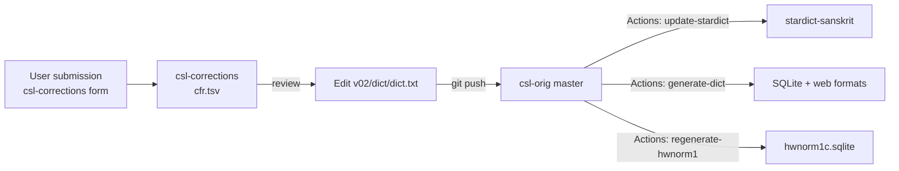
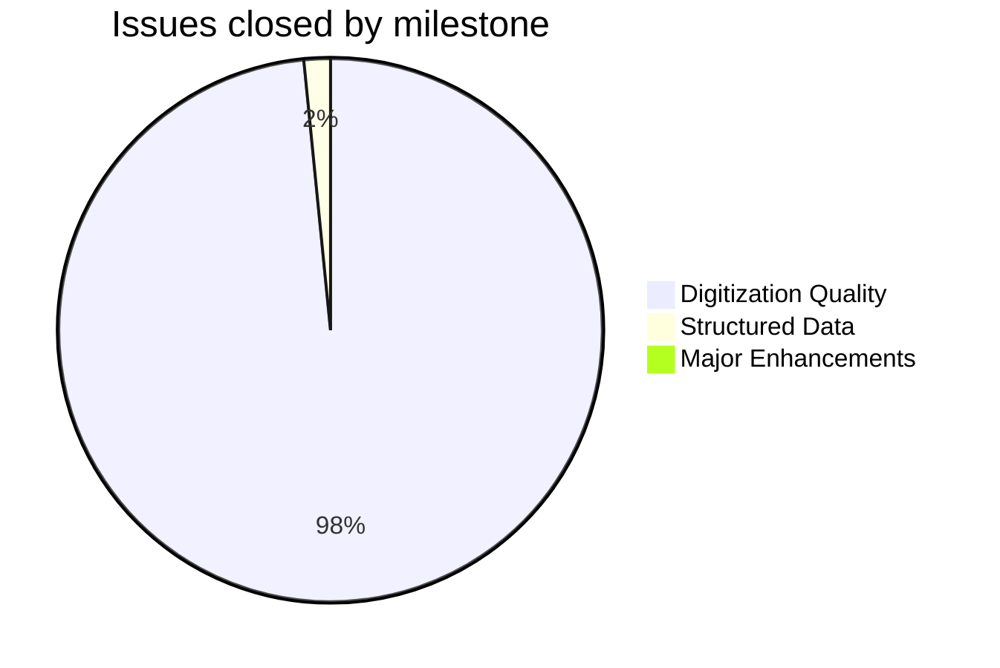
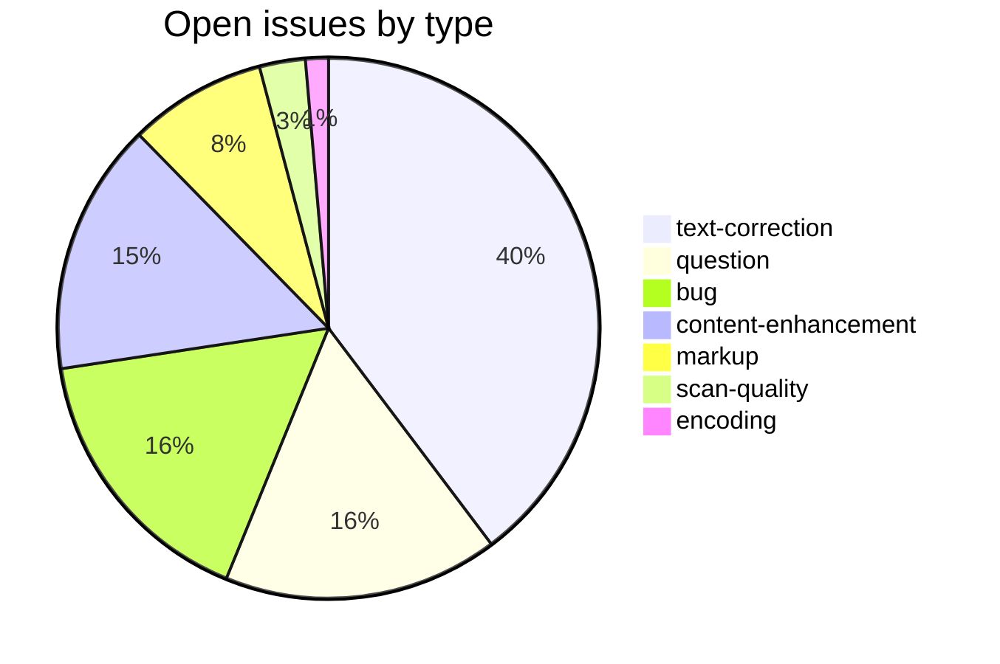
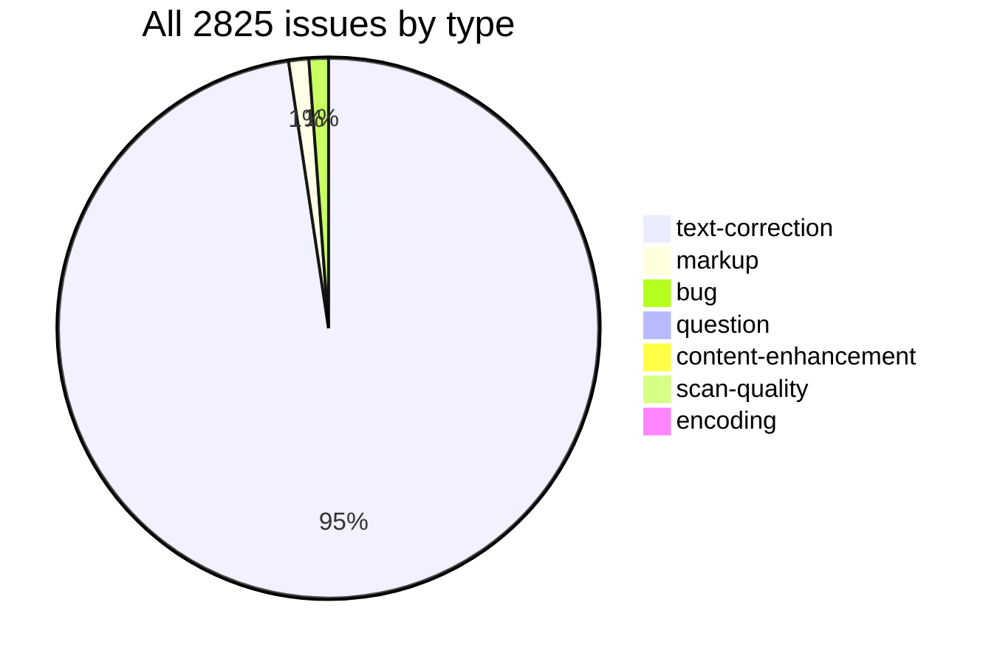

# CSL-Orig

Source data repository for the [Cologne Sanskrit Lexicon](https://www.sanskrit-lexicon.uni-koeln.de/) project. Contains digitized entries for 43 Sanskrit dictionaries, maintained through a git-based correction workflow. Downstream repositories use this data to generate SQLite databases, web interfaces, and StarDict/Babylon files for end users.

---

## Dictionaries

| Code | Title |
|------|-------|
| ABCH | Abhidhānacintāmaṇi |
| ACC | Aufrecht's Catalogus Catalogorum |
| ACPH | Abhidhānacintāmaṇipariśiṣṭa |
| ACSJ | Abhidhānacintāmaṇiśiloñcha |
| AE | Apte's Student's English-Sanskrit Dictionary |
| AP | Apte's Practical Sanskrit-English Dictionary (1957, revised) |
| AP90 | Apte's Practical Sanskrit-English Dictionary (1890) |
| ARMH | Abhidhānaratnamālā (Halāyudha) |
| BEN | Benfey's Sanskrit-English Dictionary |
| BHS | Edgerton's Buddhist Hybrid Sanskrit Dictionary |
| BOP | Bopp's Glossarium Sanscritum |
| BOR | Borooah's English-Sanskrit Dictionary |
| BUR | Burnouf's Dictionnaire Classique Sanskrit-Français |
| CAE | Cappeller's Sanskrit-English Dictionary |
| CCS | Cappeller's Sanskrit-Wörterbuch |
| FRI | Multilingual Sanskrit dictionary (Czech, Russian, English) |
| GRA | Grassmann's Wörterbuch zum Rig-Veda |
| GST | Goldstücker's Dictionary, Sanskrit and English |
| IEG | Sircar's Indian Epigraphical Glossary |
| INM | Sörensen's Index to the Names in the Mahābhārata |
| KRM | Ramasubba Sastri's Kṛdantarūpamālā |
| LAN | Lanman's Sanskrit Reader |
| LRV | Vaidya Standard Sanskrit-English Dictionary |
| MCI | Mehendale's Mahabharata Cultural Index |
| MD | Macdonell's Sanskrit-English Dictionary |
| MW | Monier-Williams' Sanskrit-English Dictionary (1899) |
| MW72 | Monier-Williams' Sanskrit-English Dictionary (1872) |
| MWE | Monier-Williams' English-Sanskrit Dictionary |
| PE | Vettam Mani's Purāṇic Encyclopedia |
| PGN | Sharma's Personal and Geographical Names in the Gupta Inscriptions |
| PUI | Dikshitar's Purāṇa Index |
| PW | Böhtlingk's Sanskrit-Wörterbuch in kürzerer Fassung |
| PWG | Böhtlingk and Roth's Sanskrit Wörterbuch |
| PWKVN | Böhtlingk's Sanskrit-Wörterbuch, Nachträge und Verbesserungen |
| SCH | Schmidt's Nachträge zum Sanskrit-Wörterbuch |
| SHS | Vidyāsāgara's Śabda-sāgara |
| SKD | Rādhākāntadeva's Śabdakalpadruma |
| SNP | Meulenbeld's Sanskrit Names of Plants |
| STC | Stchoupak's Dictionnaire Sanskrit-Français |
| VCP | Tāranātha Tarkavācaspati's Vācaspatya |
| VEI | Macdonell and Keith's Vedic Index of Names and Subjects |
| WIL | Wilson's Dictionary in Sanscrit and English |
| YAT | Yates's Dictionary in Sanscrit and English |

---

## Repository Layout

```
v02/<dict>/          # One directory per dictionary (lowercase abbreviation)
    XXX.txt          # Main entry data
    XXX_hwextra.txt  # Alternate/extra headwords
    XXXheader.xml    # TEI XML metadata (title, author, license)
    XXX-meta2.txt    # Format documentation for that dictionary
    prep/            # Auxiliary preparation scripts (not main data)
v00/                 # Legacy archive (initialization history only)
reorg/               # Notes on v00 → v02 reorganisation
```

---

## Encoding

- UTF-8 NFC throughout; LF line endings enforced by `.gitattributes`.
- Sanskrit text in SLP1 transliteration, wrapped in `{#…#}`.
- Display layer uses IAST (ISO 15919) and Devanagari, generated downstream by `csl-pywork`/`transcoder`.
- Round-trip verified for the vast majority of entries; exceptions tracked under issue label `encoding`.

---

## How corrections flow



---

## Timeline

### 2019 — Initial structure
- **Jul**: Initial commit; data for all 43 dictionaries imported from legacy Cologne SVN layout
- **Jul–Sep**: MW, PWG headword corrections; Greek and Arabic text installed (BEN, YAT, SNP, PW, PWG)
- **Nov**: Repository reorganised from `v00/csl-data/XXXScan/2020/orig/` to canonical `v02/<dict>/` layout; header and meta files migrated from `csl-pywork`

### 2020 — Systematic markup modernisation
- **Jan–Mar**: Upasarga markup for WIL, YAT, SHS, KRM; MW headword corrections; AP90 class-pada fixes
- **Apr–Jun**: MW72 Unicode; MW Varttika abbreviations; SHS prefixed verb corrections; CAE/BEN text corrections
- **Jul–Dec**: GRA IAST conversion complete; MW link standardisation; BHS, BOP, KRM, PE batch corrections

### 2021 — High-volume correction batches (392 commits)
- **Jan**: ACC, AP90 English corrections from `csl-corrections` issues
- **Jan–Jun**: PE batch corrections (batches 1–8); SHS large IAST/markup batches; MD, BEN, ACC targeted fixes
- **Jul–Dec**: MW markup batches; PWG, PW systematic corrections; VCP, SKD headword improvements

### 2022 — Targeted fixes
- Ongoing correction-form batches applied across MW, AP, SHS, GRA, BUR, STCPattern-based markup fixes; SCH and PWG corrections

### 2023 — Ongoing corrections
- MW, AP, GRA, BUR, SHS, LRV batch corrections
- Printchange file reconciliation across multiple dictionaries

### 2024 — Link standardisation and new sources
- **Throughout**: MW `<ls>` link standardisation (BhP, Bhāg. P. references)
- **Dec**: PW, SCH link standardisation; BHS version 1 corrections

### 2025 — Large backlogs processed
- Scott backlogs for MW, AP, LRV, SHS, AP90, VCP applied in batches
- fFxX encoding fixes across BUR, BHS, GRA, MD, PWG, MCI, MW72, STC, IEG, INM, PE, PGN, VEI (encoding issue #7)

### 2026 — Automation and printchange integration
- Major printchange file updates for AE, AP, AP90, CAE, CCS, GRA, etc.
- GitHub Actions workflows for StarDict, hwnorm1, and csl-sqlite generation

---

## Projects & Milestones

Issues are organised into four milestones matching the org-wide GitHub Projects:

| Milestone | Project | Open | Closed | Total |
|---|---|---:|---:|---:|
| Dictionary to Book | DTB | 0 | 0 | **0** |
| Digitization Quality | DQ | 44 | 2695 | **2739** |
| Structured Data | SD | 18 | 43 | **61** |
| Major Enhancements | ME | 11 | 14 | **25** |
| **Total** | | **73** | **2752** | **2825** |





---

## Issue Typology

### Open (73)

| # | Type | Title | Severity |
|---|---|---|---|
| [#161](https://github.com/sanskrit-lexicon/csl-orig/issues/161) | markup | Malformed abbreviations | minor |
| [#174](https://github.com/sanskrit-lexicon/csl-orig/issues/174) | text-correction | SKD verb headwords handling | minor |
| [#181](https://github.com/sanskrit-lexicon/csl-orig/issues/181) | markup | VCP: another upasarga format | minor |
| [#270](https://github.com/sanskrit-lexicon/csl-orig/issues/270) | text-correction | MW: L=669, akzanvat | minor |
| [#315](https://github.com/sanskrit-lexicon/csl-orig/issues/315) | markup | Dictionaries missing abbreviations | medium |
| [#318](https://github.com/sanskrit-lexicon/csl-orig/issues/318) | text-correction | WIL botany Roxburgh / linnaeus | medium |
| [#361](https://github.com/sanskrit-lexicon/csl-orig/issues/361) | content-enhancement | Add missing feminines | medium |
| [#468](https://github.com/sanskrit-lexicon/csl-orig/issues/468) | bug | PE batches 1 and 2 review | medium |
| [#484](https://github.com/sanskrit-lexicon/csl-orig/issues/484) | text-correction | pwg:55553 | minor |
| [#526](https://github.com/sanskrit-lexicon/csl-orig/issues/526) | markup | ap57: add ls markup | medium |
| [#533](https://github.com/sanskrit-lexicon/csl-orig/issues/533) | content-enhancement | mw:30009 | medium |
| [#603](https://github.com/sanskrit-lexicon/csl-orig/issues/603) | question | Readme for csl-orig | minor |
| [#604](https://github.com/sanskrit-lexicon/csl-orig/issues/604) | question | Fix data format for Andhrabharati | minor |
| [#605](https://github.com/sanskrit-lexicon/csl-orig/issues/605) | bug | Are we putting accents at wrong place? | minor |
| [#606](https://github.com/sanskrit-lexicon/csl-orig/issues/606) | bug | Remove punctuation marks out of Devanagari | minor |
| [#608](https://github.com/sanskrit-lexicon/csl-orig/issues/608) | scan-quality | BUR image | minor |
| [#613](https://github.com/sanskrit-lexicon/csl-orig/issues/613) | text-correction | KRM suggestion | minor |
| [#615](https://github.com/sanskrit-lexicon/csl-orig/issues/615) | scan-quality | WIL image in text | minor |
| [#619](https://github.com/sanskrit-lexicon/csl-orig/issues/619) | question | How to revert an erroneous commit | minor |
| [#624](https://github.com/sanskrit-lexicon/csl-orig/issues/624) | bug | vcp:8433 izwakarman | minor |
| [#627](https://github.com/sanskrit-lexicon/csl-orig/issues/627) | bug | BEN — Devanagari and IAST comparison | medium |
| [#628](https://github.com/sanskrit-lexicon/csl-orig/issues/628) | bug | MD — Devanagari and IAST comparison | medium |
| [#630](https://github.com/sanskrit-lexicon/csl-orig/issues/630) | bug | PD — Devanagari IAST comparison | medium |
| [#631](https://github.com/sanskrit-lexicon/csl-orig/issues/631) | question | IAST — ऌ v/s ळ | minor |
| [#633](https://github.com/sanskrit-lexicon/csl-orig/issues/633) | bug | ab tag inside  tag in BEN | minor |
| [#690](https://github.com/sanskrit-lexicon/csl-orig/issues/690) | bug | KRM errors in adding \<sup\> tag | minor |
| [#691](https://github.com/sanskrit-lexicon/csl-orig/issues/691) | question | AP90 — single entry of `` | minor |
| [#692](https://github.com/sanskrit-lexicon/csl-orig/issues/692) | question | AP90 — single entry of `¦ ` | minor |
| [#711](https://github.com/sanskrit-lexicon/csl-orig/issues/711) | text-correction | mw:28747 | minor |
| [#745](https://github.com/sanskrit-lexicon/csl-orig/issues/745) | content-enhancement | Erroneous space after hyphen at end of line | medium |
| [#747](https://github.com/sanskrit-lexicon/csl-orig/issues/747) | question | Allow for common-sense manual improvements | minor |
| [#770](https://github.com/sanskrit-lexicon/csl-orig/issues/770) | content-enhancement | mw:41336.3 | medium |
| [#800](https://github.com/sanskrit-lexicon/csl-orig/issues/800) | content-enhancement | bur:16777 | medium |
| [#852](https://github.com/sanskrit-lexicon/csl-orig/issues/852) | content-enhancement | MW: inadequacy of 'prec.' | medium |
| [#853](https://github.com/sanskrit-lexicon/csl-orig/issues/853) | content-enhancement | Merge entries with dangling 'ls' | medium |
| [#923](https://github.com/sanskrit-lexicon/csl-orig/issues/923) | text-correction | mw:12831 | minor |
| [#1058](https://github.com/sanskrit-lexicon/csl-orig/issues/1058) | content-enhancement | Add etymology markup | medium |
| [#1059](https://github.com/sanskrit-lexicon/csl-orig/issues/1059) | text-correction | MW '-' v/s '—' | minor |
| [#1060](https://github.com/sanskrit-lexicon/csl-orig/issues/1060) | text-correction | MW — data without any meaning | medium |
| [#1172](https://github.com/sanskrit-lexicon/csl-orig/issues/1172) | content-enhancement | gra:2801 | medium |
| [#1173](https://github.com/sanskrit-lexicon/csl-orig/issues/1173) | question | pwg:7452 | minor |
| [#1468](https://github.com/sanskrit-lexicon/csl-orig/issues/1468) | text-correction | mw:dhI inflected forms | minor |
| [#1488](https://github.com/sanskrit-lexicon/csl-orig/issues/1488) | question | GRA alternate headwords | minor |
| [#1489](https://github.com/sanskrit-lexicon/csl-orig/issues/1489) | text-correction | MW72: 18685,1 | minor |
| [#1537](https://github.com/sanskrit-lexicon/csl-orig/issues/1537) | text-correction | Capitalization in Proper Names | minor |
| [#1616](https://github.com/sanskrit-lexicon/csl-orig/issues/1616) | bug | Wrong parsing of subheadwords in MW | minor |
| [#1617](https://github.com/sanskrit-lexicon/csl-orig/issues/1617) | bug | Indentation / data error for headword categories in MW | minor |
| [#1641](https://github.com/sanskrit-lexicon/csl-orig/issues/1641) | content-enhancement | SHS dictionary | hard |
| [#1762](https://github.com/sanskrit-lexicon/csl-orig/issues/1762) | text-correction | mw:8622.1 | minor |
| [#1773](https://github.com/sanskrit-lexicon/csl-orig/issues/1773) | content-enhancement | Kozianka edition of Graßmann | hard |
| [#1779](https://github.com/sanskrit-lexicon/csl-orig/issues/1779) | text-correction | Whether 'to' tag deserves separate line in mw.txt? | minor |
| [#1780](https://github.com/sanskrit-lexicon/csl-orig/issues/1780) | text-correction | MW 4112.1 — Whether 'in comp' deserves separate headword | minor |
| [#1782](https://github.com/sanskrit-lexicon/csl-orig/issues/1782) | encoding | Actual hyphenations lost in MW | medium |
| [#1785](https://github.com/sanskrit-lexicon/csl-orig/issues/1785) | markup | Expand `id` | minor |
| [#1786](https://github.com/sanskrit-lexicon/csl-orig/issues/1786) | markup | Expand `= next` in MW | medium |
| [#1788](https://github.com/sanskrit-lexicon/csl-orig/issues/1788) | text-correction | MW 592.2 akzara | minor |
| [#1790](https://github.com/sanskrit-lexicon/csl-orig/issues/1790) | text-correction | MW 669 — akzan-vat | minor |
| [#2678](https://github.com/sanskrit-lexicon/csl-orig/issues/2678) | text-correction | MW: 79670 jIvatyAga | minor |
| [#2679](https://github.com/sanskrit-lexicon/csl-orig/issues/2679) | bug | MW 11172.1 aBAvayat | minor |
| [#2797](https://github.com/sanskrit-lexicon/csl-orig/issues/2797) | text-correction | संस्कृत-शब्दार्थ-कौस्तुभ (Sanskrit-Hindi Dictionary) | hard |
| [#2811](https://github.com/sanskrit-lexicon/csl-orig/issues/2811) | text-correction | MW — avaDAraṇa — Missing {as} and {am} | minor |
| [#2817](https://github.com/sanskrit-lexicon/csl-orig/issues/2817) | text-correction | MW — Near blank entries | medium |
| [#2821](https://github.com/sanskrit-lexicon/csl-orig/issues/2821) | text-correction | STC — s.v. not properly linked | minor |
| [#2823](https://github.com/sanskrit-lexicon/csl-orig/issues/2823) | text-correction | LRV — UhApoha | minor |
| [#2824](https://github.com/sanskrit-lexicon/csl-orig/issues/2824) | text-correction | LRV: 7287.1 — Double listing | minor |
| [#2826](https://github.com/sanskrit-lexicon/csl-orig/issues/2826) | text-correction | LRV:7508 aikadyam | minor |
| [#2837](https://github.com/sanskrit-lexicon/csl-orig/issues/2837) | text-correction | FRI: 926 | minor |
| [#2838](https://github.com/sanskrit-lexicon/csl-orig/issues/2838) | question | Github Workflow 2: csl-orig pipeline | minor |
| [#2842](https://github.com/sanskrit-lexicon/csl-orig/issues/2842) | question | Github Workflow 4: hwnorm1, csl-apidev, csl-sqlite | minor |
| [#2843](https://github.com/sanskrit-lexicon/csl-orig/issues/2843) | question | If two compounds produce the same result | minor |
| [#2845](https://github.com/sanskrit-lexicon/csl-orig/issues/2845) | text-correction | Correct MW 28747 wording | minor |
| [#2846](https://github.com/sanskrit-lexicon/csl-orig/issues/2846) | text-correction | Correct MW entry 28747 typo | minor |
| [#2847](https://github.com/sanskrit-lexicon/csl-orig/issues/2847) | text-correction | Merge dangling source lines in MW entries | minor |

### Solved (2752)

| Type | Count |
|---|---:|
| text-correction | 2650 |
| scan-quality | 22 |
| bug | 20 |
| markup | 27 |
| question | 16 |
| content-enhancement | 14 |
| encoding | 3 |
| **Total** | **2752** |



---

## Labels

### Type labels (color `#0075ca`)

| Label | Total | Description |
|---|---:|---|
| `text-correction` | 2679 | Corrections to dictionary text (definitions, headwords) |
| `markup` | 33 | Normalising XML tag content (`<ls>`, `<lex>`, `<ab>`, etc.) |
| `bug` | 32 | Broken links, XML structure errors, broken scripts |
| `question` | 28 | Scholarly questions requiring research before any code change |
| `content-enhancement` | 25 | New material, display upgrades, structural additions |
| `scan-quality` | 24 | Replacing blurry, skewed, or missing scan pages |
| `encoding` | 4 | SLP1/IAST transcoding, character rendering, hyphen/dash normalisation |
| `link-target` | 0 | Building click-throughs from `<ls>` abbreviations to scanned PDF pages |
| `link-splitting` | 0 | Splitting combined `SOURCE N,N` refs into individual per-page links |

### Severity labels

| Label | Color | Description |
|---|---|---|
| `minor` | `#e4e669` | Targeted, self-contained fix |
| `medium` | `#fbca04` | Standard unit of work — one index, a batch of corrections |
| `hard` | `#d93f0b` | Large effort spanning many sources, files, or dictionaries |

---

## Contributors

| Person | Commits | Role |
|---|---:|---|
| **Jim Funderburk** (funderburkjim) | 1224 | Founder and primary maintainer; correction pipeline architecture and bulk corrections 2019–2022 |
| **Dr. Dhaval Patel** (drdhaval2785) | 644 | Current active maintainer; automation, printchange workflow, daily correction batches |
| aumsanskrit | 17 | Greek and Russian text contributions (FRI, SNP) |
| AnnaRybakovaT | 11 | Russian-language corrections |
| shenyileirob | 8 | Targeted corrections |
| **Mārcis Gasūns** | 5 | Issue triage and tooling |

---

## Related Repositories

| Repository | Role |
|---|---|
| [csl-corrections](https://github.com/sanskrit-lexicon/csl-corrections) | User correction submissions and tracking |
| [csl-pywork](https://github.com/sanskrit-lexicon/csl-pywork) | Dictionary processing pipelines |
| [csl-websanlexicon](https://github.com/sanskrit-lexicon/csl-websanlexicon) | Web interface generation |
| [hwnorm1](https://github.com/sanskrit-lexicon/hwnorm1) | Normalized headword database |
| [stardict-sanskrit](https://github.com/indic-dict/stardict-sanskrit) | End-user StarDict distribution |
| [csl-sqlite](https://github.com/sanskrit-lexicon/csl-sqlite) | SQLite release distribution |
